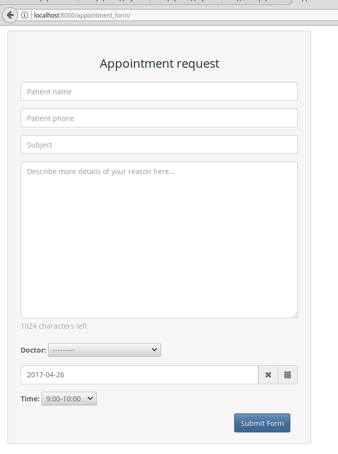
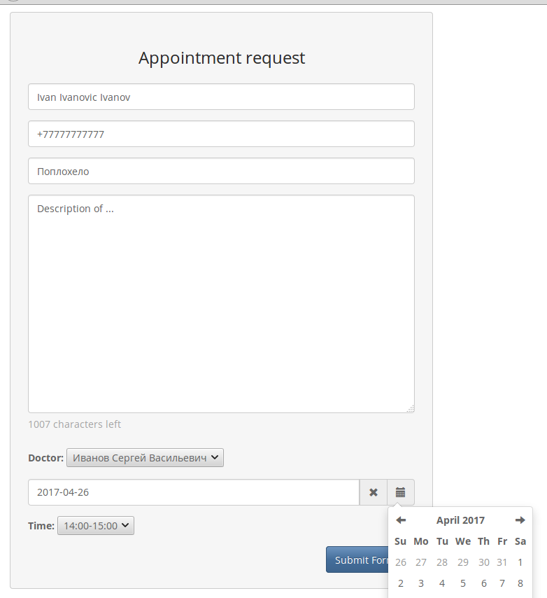
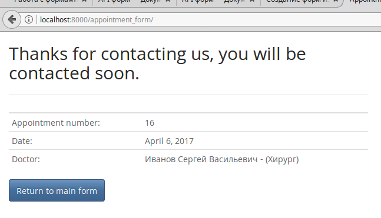
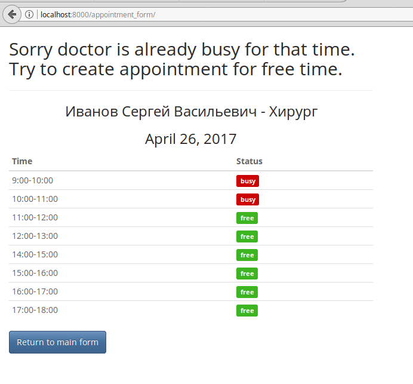
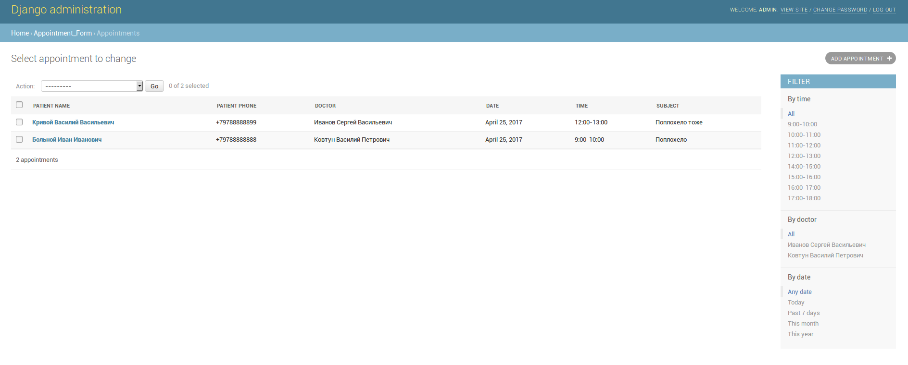

# hospital_appointment
hospital appointment form

### Form looks like: 

### Filled form looks like:

### Appointment was created successful:

### Appointment time was busy - sorry, we show free/busy time for that date:

### Admin site, Appoinments list: 

